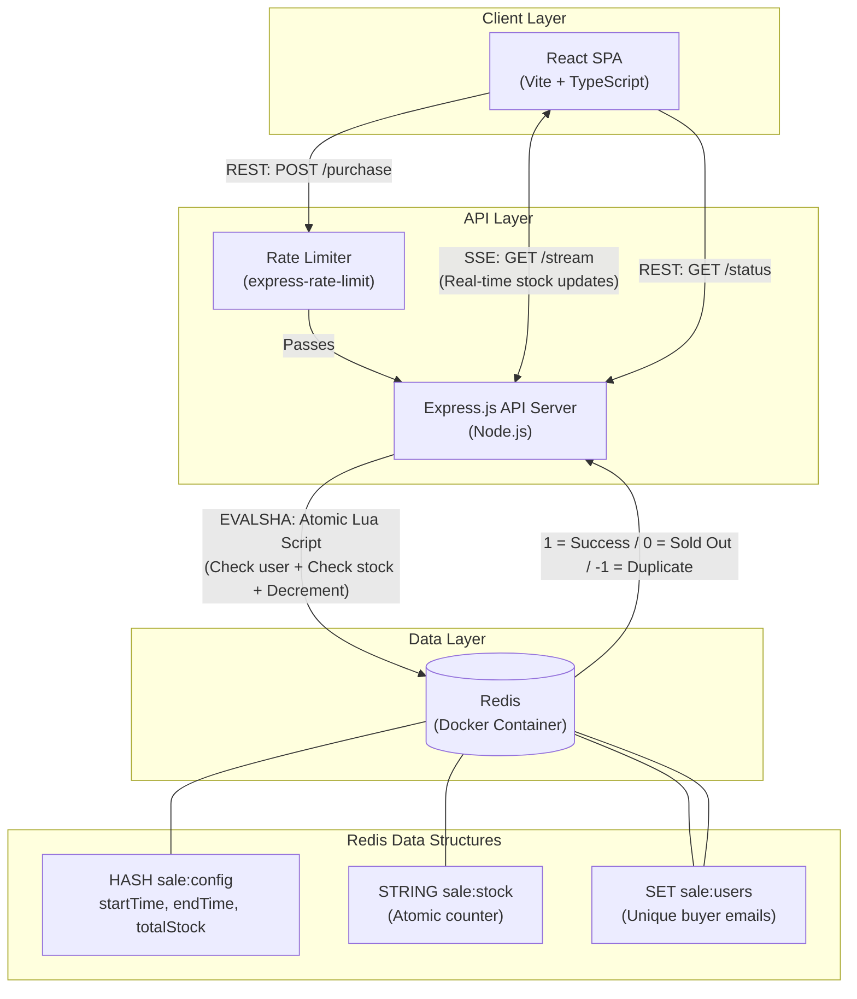

# Bookipi Full Stack Engineer Take Home Test
### **High-Throughput Flash Sale System**


🟢 **Live Demo:** [https://bookipi.babon.io/](https://bookipi.babon.io/)

### ☁️ Cloud Infrastructure
To demonstrate a production-ready deployment, the live demo is hosted across a distributed modern cloud stack:
- **Frontend:** Hosted on **Vercel** for edge-optimized static asset delivery and custom domain routing.
- **Backend:** Hosted on **Render** (Node Web Service) to maintain long-lived Server-Sent Event (SSE) connections with clients.
- **Database:** Hosted on **Upstash** (Serverless Redis) for ultra-low latency, distributed atomic transactions.

This repository contains a full-stack flash sale system designed to handle a large number of concurrent requests, prevent overselling, and ensure each user can only purchase one item.

## 🏗️ System Architecture & Diagram

To ensure the system can handle a sudden surge in traffic and manage inventory accurately, the architecture relies on an in-memory data store for all critical path operations.



### 📡 API Endpoints
The backend exposes the following REST and SSE endpoints:
* **`POST /api/sale/purchase`**: Core transaction endpoint. Evaluates Lua script, handles rate limiting.
* **`GET /api/sale/status`**: Returns current sale status (active, upcoming, ended) and total stock.
* **`GET /api/sale/stream`**: Persistent SSE connection that pushes real-time stock decrements and status changes to clients.
* **`GET /api/sale/purchase-status?userId=X`**: Checks if a user has successfully purchased.
* **`GET /api/sale/config`**: (Admin) Retrieves the current sale start/end times and total stock.
* **`POST /api/sale/config`**: (Admin) Updates the sale start/end times and total stock dynamically.
* **`GET /api/sale/buyers`**: (Admin) Returns the set of all emails/IDs that successfully secured an item.

### 🧠 Design Choices & Trade-offs

* **Redis as the Primary Database:** Traditional relational databases suffer from locking and race conditions under heavy concurrent load. By using Redis, we leverage its single-threaded nature to process commands sequentially, ensuring absolute consistency for the critical purchase path.
* **Atomic Lua Scripting:** Checking stock, verifying user uniqueness, and decrementing stock are combined into a single atomic Lua script evaluated by Redis. This guarantees that no other commands can interleave during the transaction, completely eliminating race conditions and overselling. The Lua script returns three distinct codes: `1` (success), `0` (sold out), `-1` (already purchased), enabling clean error handling upstream.
* **Server-Sent Events (SSE) for Real-Time Updates:** Instead of polling the server every few seconds (which multiplies load linearly with user count), the frontend establishes a persistent SSE connection (`GET /api/sale/stream`). The server pushes stock updates to all connected clients whenever a purchase occurs. This was chosen over WebSockets because the data flow is unidirectional (server → client), making SSE the simpler and more appropriate protocol.
* **Rate Limiting:** The purchase endpoint is protected by `express-rate-limit` (10 requests per 10-second window per IP) to mitigate abuse and denial-of-service attempts without impacting legitimate users.
* **Component-Based Frontend Architecture:** The React frontend is structured with a clear separation of concerns — UI components (`components/`), API service layer (`services/api.ts`), and application state orchestration (`App.tsx`). This mirrors production-grade patterns and ensures the codebase is maintainable and testable.
* **Monorepo Structure:** The frontend, backend, and all testing suites are housed in a single repository. While microservices might be used in a larger production environment, a monorepo provides the simplest developer experience for building, running, and reviewing this specific project.

### 🛡️ Robustness & Fault Tolerance
Designing for high throughput requires acknowledging and mitigating potential points of failure:
* **Server Crashes & Restarts:** State is entirely externalized to Redis. If the Express server crashes mid-sale, no data is lost. Upon restarting, the server uses an atomic `HSETNX` and `SET ... NX` initialization sequence to ensure it never overwrites an ongoing sale or existing stock count.
* **Redis Downtime:** Redis acts as the single source of truth. If Redis goes down, the Express API will cleanly return HTTP 500 errors. Once Redis recovers, the system automatically resumes processing without needing manual intervention or data reconciliation.
* **Network Partitions:** If communication between Express and Redis drops, purchase attempts will time out and return an error to the user. Since the Lua script transaction logic lives entirely inside Redis, a partial execution or split-brain scenario where stock is decremented but the user isn't recorded is impossible.
* **Future Scaling (Checkout & Message Queues):** This system is scoped to the high-throughput inventory reservation phase. In a complete e-commerce platform, this reservation would grant the user a temporary lock. The system would drop the successful reservation onto a message queue (e.g., RabbitMQ, Kafka) to be consumed by a slower checkout/payment service, decoupling the ultra-fast Redis reservation from the slower third-party payment gateway. At that payment phase, strict idempotency keys would be introduced to prevent double-charging.

---

## 🚀 How to Run the Project

### Prerequisites
* Node.js (v18+ recommended)
* Docker & Docker Desktop (running)

### 1. Start the Database
The system uses a containerized Redis instance to handle concurrency control.
```bash
docker-compose up -d
```

### 2. Start the Backend API
Navigate to the backend directory, install dependencies, and start the development server.
```bash
cd backend
npm install
npm run dev
```
*The server will start on `http://localhost:3001` and automatically initialize a stock of 100 items.*

### 3. Start the Frontend UI
Open a new terminal window, navigate to the frontend directory, install dependencies, and start Vite.
```bash
cd frontend
npm install
cp .env.example .env
npm run dev
```
*The app will be available at `http://localhost:5173`.*

---

## 🧪 Testing Suites

This project includes three distinct layers of testing to prove system robustness. Ensure the backend and database are running before executing these tests.

### Unit & Integration Tests (Business Logic)
Tests the core Redis Lua scripts to ensure the "one item per user" and "limited stock" rules are correctly enforced.

**Unit Tests (Mocks Redis):**
```bash
cd backend
npm test
```

**Integration Tests (Real Redis):**
```bash
cd backend
npm run test:integration
```

### End-to-End Tests (User Journey)
Uses Playwright to simulate a real user navigating the frontend, attempting a purchase, and verifying the UI accurately reflects backend constraints.
```bash
cd e2e-tests
npm install
npm test
```

### Stress Tests (High Throughput Simulation)
Uses Artillery to simulate thousands of concurrent users attempting to purchase the limited stock simultaneously. 

**How to run:**
To see the concurrency controls in action, you must run the backend server in `test` mode to bypass the strict IP rate limiter (otherwise, Artillery will just get 1980 HTTP 429 Too Many Requests errors since all requests originate from your local IP).

1. Start the backend in test mode (in a separate terminal):
   ```bash
   cd backend
   NODE_ENV=test npm run dev
   ```
2. Run the stress test and the invariant verification script:
   ```bash
   cd stress-tests
   npm install
   npm test
   ```

**Stress Test Expected Outcomes:**
The Artillery script blasts the `/purchase` endpoint with 2,000 unique virtual users over a 10-second window. After it finishes, an automated verification script connects directly to Redis to mathematically prove the concurrency controls are completely effective:
* **HTTP 200 (Success): Exactly equal to total stock.** The system correctly limits purchases to the predefined stock, regardless of concurrent request volume.
* **HTTP 400 (Bad Request): The remaining users.** Rejected safely with accurate error messaging (Sold Out / Already Purchased).
* **HTTP 500 (Server Error): 0.** The Express server remains stable and handles the load without crashing.
* **Invariant Check (Passed):** The post-test script verifies that Redis stock is exactly `0` and exactly `N` unique users are recorded in the buyers set, proving no overselling or double-purchasing occurred.

---

## 🤖 AI Utilization & Development Process

This project was built using a modern, AI-assisted development workflow. By leveraging multiple Large Language Models (LLMs), I was able to rapidly prototype, iterate, and refine complex architectural patterns:

* **Brainstorming & Architecture:** I used AI to explore different concurrency control mechanisms, evaluating the trade-offs between traditional SQL transactions, message queues, and Redis Lua scripting before settling on the atomic Redis approach for maximum throughput.
* **Implementation:** I utilized AI coding assistants to quickly scaffold boilerplate code, generate the React component structure, and write the initial Express.js routes, allowing me to focus entirely on the complex business logic (the Lua scripts and SSE stream).
* **Iterating & Debugging:** I actively engaged with multiple LLMs to troubleshoot rate-limiting behavior during stress testing, refine the Playwright E2E testing setup, and optimize the frontend UX based on design feedback.
* **Testing Generation:** The automated testing suites (unit, integration, and Artillery stress tests) were heavily accelerated by AI, ensuring comprehensive test coverage across all edge cases without manually writing hundreds of lines of repetitive test assertions.

Crucially, my years of experience in software engineering provided the foundational intuition needed to guide these models effectively. Having deep domain knowledge and a strong **product-builder mindset** allowed me to enforce architectural best practices, prioritize user experience, ask the right questions, and critically evaluate the AI's suggestions. This dynamic doesn't just allow me to produce code faster—it enables me to learn and adapt to new paradigms much more effectively.