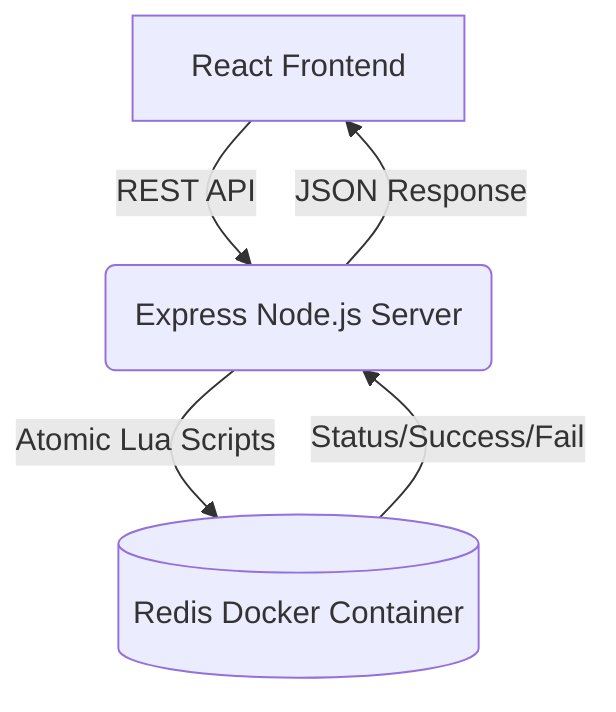

# High-Throughput Flash Sale System

This repository contains a full-stack flash sale system designed to handle a large number of concurrent requests, prevent overselling, and ensure each user can only purchase one item.

## 🏗️ System Architecture & Diagram

To ensure the system can handle a sudden surge in traffic and manage inventory accurately, the architecture relies on an in-memory data store for all critical path operations.



### Design Choices & Trade-offs
* **Redis as the Primary Database:** Traditional relational databases suffer from locking and race conditions under heavy concurrent load. By using Redis, we leverage its single-threaded nature to process commands sequentially, ensuring absolute consistency.
* **Atomic Lua Scripting:** Checking stock, verifying user uniqueness, and decrementing stock are combined into a single atomic Lua script evaluated by Redis. This guarantees that no other commands can interleave during the transaction, completely eliminating race conditions and overselling.
* **Monorepo Structure:** The frontend, backend, and all testing suites are housed in a single repository. While microservices might be used in a larger production environment, a monorepo provides the simplest developer experience for building, running, and reviewing this specific project.
* **Pragmatic UI:** The frontend is built with React and styled using Tailwind CSS. This allows for a clean, responsive, and modern interface without over-engineering complex custom CSS architectures.

---

## 🚀 How to Run the Project

### Prerequisites
* Node.js (v18+ recommended)
* Docker & Docker Desktop (running)

### 1. Start the Database
The system uses a containerized Redis instance to handle concurrency control.
```bash
docker-compose up -d
```

### 2. Start the Backend API
Navigate to the backend directory, install dependencies, and start the development server.
```bash
cd backend
npm install
npm run dev
```
*The server will start on `http://localhost:3001` and automatically initialize a stock of 100 items.*

### 3. Start the Frontend UI
Open a new terminal window, navigate to the frontend directory, install dependencies, and start Vite.
```bash
cd frontend
npm install
npm run dev
```
*The app will be available at `http://localhost:5173`.*

---

## 🧪 Testing Suites

This project includes three distinct layers of testing to prove system robustness. Ensure the backend and database are running before executing these tests.

### Unit & Integration Tests (Business Logic)
Tests the core Redis Lua scripts to ensure the "one item per user" and "limited stock" rules are correctly enforced.
```bash
cd backend
npm test
```

### End-to-End Tests (User Journey)
Uses Playwright to simulate a real user navigating the frontend, attempting a purchase, and verifying the UI accurately reflects backend constraints.
```bash
cd e2e-tests
npm install
npx playwright test
```

### Stress Tests (High Throughput Simulation)
Uses Artillery to simulate thousands of concurrent users attempting to purchase the limited stock simultaneously. 

**How to run:**
```bash
cd stress-tests
npm install
npx artillery run load-test.yml
```

**Stress Test Expected Outcomes:**
The Artillery script blasts the `/purchase` endpoint with 2,000 unique virtual users over a 10-second window. The expected outcome proves the concurrency controls are completely effective:
* **HTTP 200 (Success): Exactly 100.** The system correctly limits purchases to the predefined stock, regardless of concurrent request volume.
* **HTTP 400 (Bad Request): Exactly 1900.** The remaining users are safely rejected with accurate error messaging (Sold Out / Already Purchased).
* **HTTP 500 (Server Error): 0.** The Express server remains stable and handles the load without crashing.